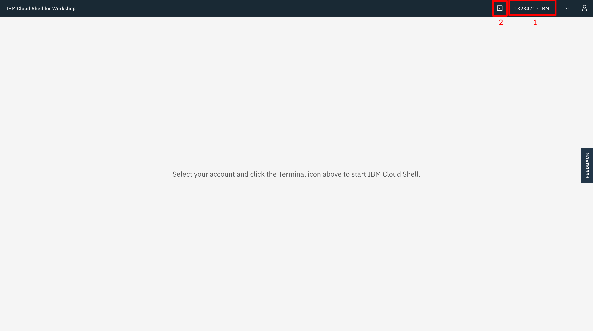
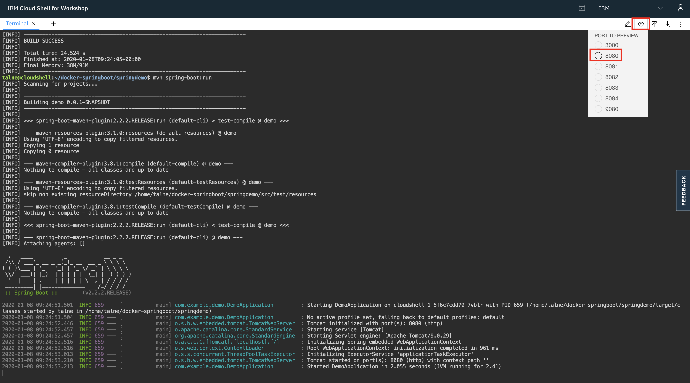
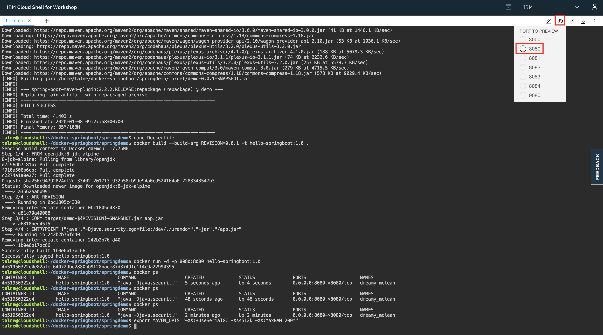

# Prerequisite

Before we will start the exercise you will need to go to IBM Cloud Shell to get ready to use environment : https://workshop.shell.cloud.ibm.com/
You will have to login with your IBM Cloud user and then use the password : ikslab



1) Select the account with the openshift cluster.
2) Start the terminal.

# Exercise 1: Deploying your first Springboot app

Copy git repo:
```
$ git clone https://github.com/tal2k4xj/docker-springboot.git	
```

Change directory:
```
$ cd docker-springboot/springdemo
```

Run Springboot application:
```
$ mvn spring-boot:run
```

Go to port 8080 and add /api/hello to see our application running:
*(https://p8080-user-ibmid-<somerandomid>.workshop.us-south.shell.cloud.ibm.com/api/hello)*



# Exercise 2: Build & Run docker springboot

Before we build the dockerfile we need to package the application to jar file:
```
$ mvn clean -Dmaven.test.skip package
```

Create a Dockerfile:
```
$ nano Dockerfile
```

Copy & paste:
```
FROM openjdk:8-jdk-alpine
ARG REVISION
COPY target/demo-${REVISION}-SNAPSHOT.jar app.jar
ENTRYPOINT ["java","-Djava.security.egd=file:/dev/./urandom","-jar","/app.jar"]
```

** To exit "nano" editor press: ctrl+x -> Y -> Enter.

Build the image:
```
$ docker build --build-arg REVISION=0.0.1 -t hello-springboot:1.0 .
```

Run the application:
```
docker run -d -p 8080:8080 hello-springboot:1.0
```

Check that the docker is running:
```
$ docker ps
```

You suppose to get this:
```
CONTAINER ID        IMAGE                  COMMAND                  CREATED             STATUS              PORTS                    NAMES
4b51950322c4        hello-springboot:1.0   "java -Djava.securit…"   5 seconds ago       Up 4 seconds        0.0.0.0:8080->8080/tcp   dreamy_mclean
```

Go to port 8080 again and add /api/hello to see our application running:
*(https://p8080-user-ibmid-<somerandomid>.workshop.us-south.shell.cloud.ibm.com/api/hello)*



*** NOTE - If you get any errors like "no port connected" try to use this command: ***
```
$ export MAVEN_OPTS="-XX:+UseSerialGC -Xss512k -XX:MaxRAM=200m"
```
And repeat the exercise.

# Exercise 3: How to build better images using layers

First lets understand layers in docker image, to see the layers we need to IMAGE ID:
```
$ docker ps
```

Now copy the IMAGE ID of `hello-springboot` and do the following command:
```
$ docker history <IMAGE-ID>
```

You should get the following:
```
IMAGE               CREATED             CREATED BY                                      SIZE                COMMENT
1b0e6b17bc66        2 hours ago         /bin/sh -c #(nop)  ENTRYPOINT ["java" "-Djav…   0B                  
a6818bed45f5        2 hours ago         /bin/sh -c #(nop) COPY file:0a763dac3342ead3…   17.6MB              
a81c70a40088        2 hours ago         /bin/sh -c #(nop)  ARG REVISION                 0B                  
a3562aa0b991        8 months ago        /bin/sh -c set -x  && apk add --no-cache   o…   99.3MB              
<missing>           8 months ago        /bin/sh -c #(nop)  ENV JAVA_ALPINE_VERSION=8…   0B                  
<missing>           8 months ago        /bin/sh -c #(nop)  ENV JAVA_VERSION=8u212       0B                  
<missing>           8 months ago        /bin/sh -c #(nop)  ENV PATH=/usr/local/sbin:…   0B                  
<missing>           8 months ago        /bin/sh -c #(nop)  ENV JAVA_HOME=/usr/lib/jv…   0B                  
<missing>           8 months ago        /bin/sh -c {   echo '#!/bin/sh';   echo 'set…   87B                 
<missing>           8 months ago        /bin/sh -c #(nop)  ENV LANG=C.UTF-8             0B                  
<missing>           8 months ago        /bin/sh -c #(nop)  CMD ["/bin/sh"]              0B                  
<missing>           8 months ago        /bin/sh -c #(nop) ADD file:a86aea1f3a7d68f6a…   5.53MB
```
First we can tell that the size of our base image is more than 100MB, also we can see that we added 3 layers on top of it in the size of 17.6MB.

This is the single layer approach where we take base image and just copy the JAR file to it and run the container.


This is a great approach for small applications, but if we will look on bigger applications we will get up to few GB which can cause us to spend alot of time whilre rebuilding the docker images everytime we change the code or dependencies.
Most of the time we usualy rebuild our docker images when the code changes and we dont want to fetch our dependencies all the time we change the code, to do that we will change our Dockerfile approach to a dual layer approach.

To understand how to do that we can just do the following example.

Open our Dockerfile and change it:
```
$ nano Dockerfile
```

```dockerfile
FROM adoptopenjdk/openjdk8-openj9 as staging

ARG JAR_FILE
ENV SPRING_BOOT_VERSION 2.0

# Install unzip; needed to unzip Open Liberty
RUN apt-get update \
    && apt-get install -y --no-install-recommends unzip \
    && rm -rf /var/lib/apt/lists/*

# Install Open Liberty
ENV LIBERTY_SHA 4170e609e1e4189e75a57bcc0e65a972e9c9ef6e
ENV LIBERTY_URL https://public.dhe.ibm.com/ibmdl/export/pub/software/openliberty/runtime/release/2018-06-19_0502/openliberty-18.0.0.2.zip

RUN curl -sL "$LIBERTY_URL" -o /tmp/wlp.zip \
   && echo "$LIBERTY_SHA  /tmp/wlp.zip" > /tmp/wlp.zip.sha1 \
   && sha1sum -c /tmp/wlp.zip.sha1 \
   && mkdir /opt/ol \
   && unzip -q /tmp/wlp.zip -d /opt/ol \
   && rm /tmp/wlp.zip \
   && rm /tmp/wlp.zip.sha1 \
   && mkdir -p /opt/ol/wlp/usr/servers/springServer/ \
   && echo spring.boot.version="$SPRING_BOOT_VERSION" > /opt/ol/wlp/usr/servers/springServer/bootstrap.properties \
   && echo \
'<?xml version="1.0" encoding="UTF-8"?> \
<server description="Spring Boot Server"> \
  <featureManager> \
    <feature>jsp-2.3</feature> \
    <feature>transportSecurity-1.0</feature> \
    <feature>websocket-1.1</feature> \
    <feature>springBoot-${spring.boot.version}</feature> \
  </featureManager> \
  <httpEndpoint id="defaultHttpEndpoint" host="*" httpPort="9080" httpsPort="9443" /> \
  <include location="appconfig.xml"/> \
</server>' > /opt/ol/wlp/usr/servers/springServer/server.xml \
   && /opt/ol/wlp/bin/server start springServer \
   && /opt/ol/wlp/bin/server stop springServer \
   && echo \
'<?xml version="1.0" encoding="UTF-8"?> \
<server description="Spring Boot application config"> \
  <springBootApplication location="app" name="Spring Boot application" /> \
</server>' > /opt/ol/wlp/usr/servers/springServer/appconfig.xml

# Stage the fat JAR
COPY ${JAR_FILE} /staging/myFatApp.jar

# Thin the fat application; stage the thin app output and the library cache
RUN /opt/ol/wlp/bin/springBootUtility thin \
 --sourceAppPath=/staging/myFatApp.jar \
 --targetThinAppPath=/staging/myThinApp.jar \
 --targetLibCachePath=/staging/lib.index.cache

# unzip thin app to avoid cache changes for new JAR
RUN mkdir /staging/myThinApp \
   && unzip -q /staging/myThinApp.jar -d /staging/myThinApp

# Final stage, only copying the liberty installation (includes primed caches)
# and the lib.index.cache and thin application
FROM adoptopenjdk/openjdk8-openj9

VOLUME /tmp

# Create the individual layers
COPY --from=staging /opt/ol/wlp /opt/ol/wlp
COPY --from=staging /staging/lib.index.cache /opt/ol/wlp/usr/shared/resources/lib.index.cache
COPY --from=staging /staging/myThinApp /opt/ol/wlp/usr/servers/springServer/apps/app

# Start the app on port 9080
EXPOSE 9080
CMD ["/opt/ol/wlp/bin/server", "run", "springServer"]
```
 


# Exercise 3: Understand Buildconfig Strategy Options
